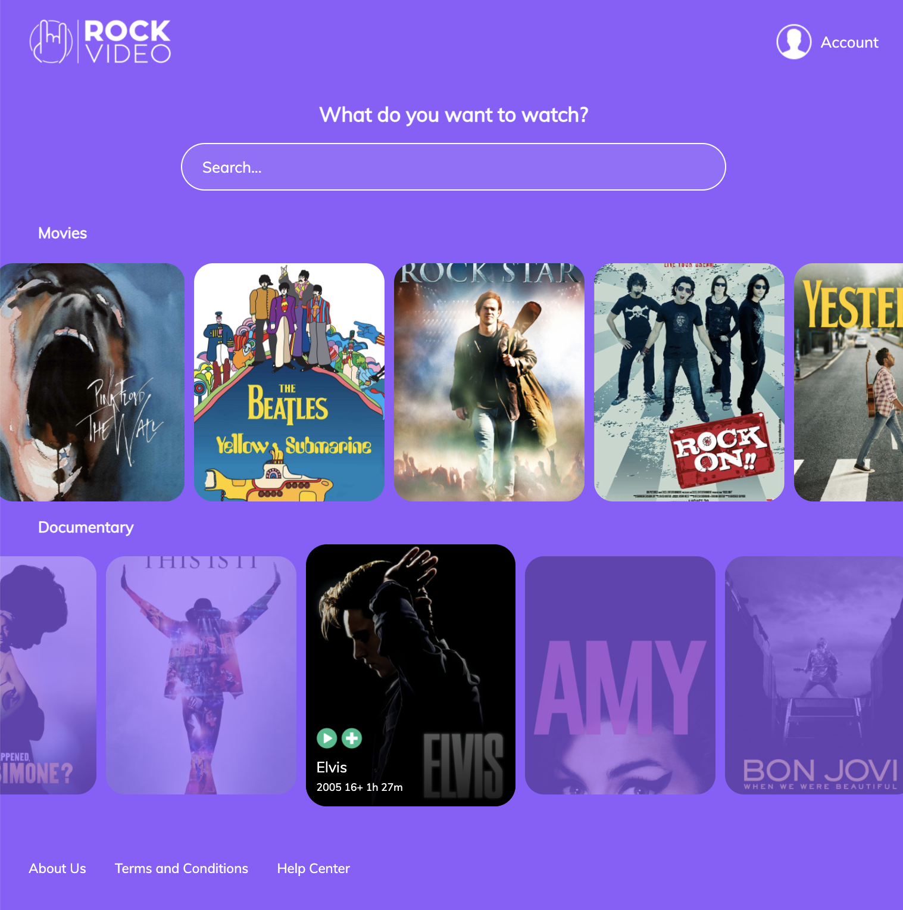

# RockVideo

I created a basic page based on Rock Movie Database. 
In this project, I wanted to practice my skills of Front End: 
* Design Login, Sign up and Home page 
* CSS flexbox layout to align and distribute space among items in a container
* Create responsive layouts

### Links

- Live Site URL: [Rock-Video](https://rock-video.netlify.app/)

### Languages and Tools
    
   
    

### Screenshots

